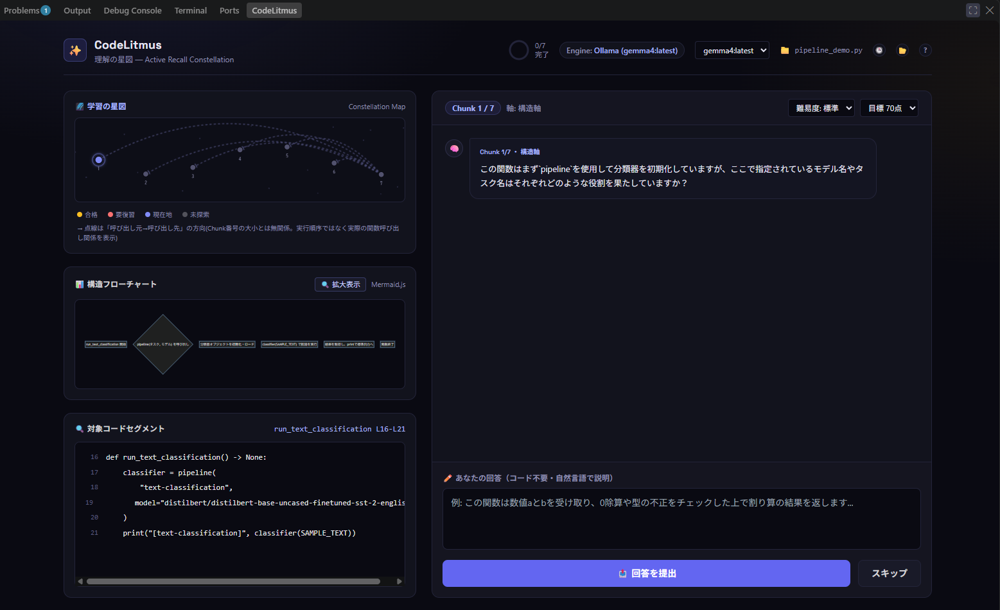

# DeDoubt

バイブコーディングによって発生する「理解負債」を、能動学習(質問→回答→採点→フィードバック)によって解消するVS Code拡張機能。

現在は開発者本人が使う前提のツールです。使いたい人は以下の手順で自分でセットアップしてください(Python/LLM周りの自動インストールは行っていません)。



下部Panel領域(TERMINAL等と同じ場所)に表示される「DEDOUBT」タブ。関数/クラス単位のChunkが星として配置され、質問への回答・厳格採点・再回答ガイドまでの一連の流れがここで進みます。

## 前提

- Python 3.11系
- Node.js / npm
- (任意) [Ollama](https://ollama.com) — ローカルLLMで採点したい場合。未導入でもMockエンジン(固定フィードバック)で動作します。

## セットアップ手順

### 1. Python環境の準備

```bash
conda create -n dedoubt python=3.11
conda activate dedoubt
pip install -r vscode-extension/requirements.txt
```

condaを使わない場合も、`vscode-extension/requirements.txt`をpip installできる仮想環境を1つ用意してください。

### 2. (任意) Ollamaのセットアップ

- [ollama.com](https://ollama.com)からインストールし、モデルを取得(例: `ollama pull llama3`)
- Ollamaが起動していない/モデル未取得の場合、拡張機能は自動的にMockLLMClient(デモ用の固定フィードバック)にフォールバックします。厳格な採点をさせたい場合は必須です。

### 3. VS Code拡張機能のビルド

```bash
cd vscode-extension
npm install
npm run compile
```

### 4. 拡張機能の起動

- VS Codeで`vscode-extension/`フォルダを開き、F5(Run Extension)で拡張機能開発ホストを起動する
- または `npx @vscode/vsce package` で`.vsix`を作成し、`code --install-extension <file>.vsix`でインストールする(Marketplace/Azure DevOpsへの`publish`にはPATが別途必要)

### 5. Python実行体の指定(必須)

拡張機能はバックエンド(`vscode-extension/main.py`)を自動でサブプロセス起動します。使用するPython実行体を、VS Codeの`settings.json`に指定してください。

```json
{
  "dedoubt.pythonPath": "C:\\Users\\<you>\\miniconda3\\envs\\dedoubt\\python.exe"
}
```

未設定の場合、拡張機能はエラーメッセージでこの設定を促します。

### 6. 使い方

- Pythonファイルを開いた状態で `Ctrl+Alt+D`(Macは`Cmd+Alt+D`)、またはコマンドパレットから「DeDoubt: 理解度テストを開始」を実行
- 画面下部のPanel領域(TERMINAL等と同じ場所)に「DeDoubt」タブが表示され、AST解析されたChunk(関数/クラス/エントリーポイント)ごとに質問→回答→採点が進みます

### 別フォルダ・複数フォルダのファイルを対象にする

DeDoubtはファイルの絶対パスだけで動くため、今開いているワークスペースの外にあるファイルでも制限なく理解度テストできます(パネル右上の「?」アイコンにも同じ内容を表示しています)。

- **1ファイルだけ試す**: `Ctrl+O`で目的のファイルを直接開く。または、エディタで何も開いていない状態で`Ctrl+Alt+D`を押すとファイル選択ダイアログが開き、どこにあるファイルでも選べる。
- **複数フォルダを並べて操作する**: コマンドパレット(`Ctrl+Shift+P`)→ `Workspaces: Add Folder to Workspace...` で、今のリポジトリと無関係な任意のフォルダを追加する。Explorerに複数のフォルダツリーが並び、どちらのファイルをアクティブにしてもDeDoubtは同じ挙動で追従する。共通の親フォルダを1つ開くだけでも同様の効果がある。
- **その組み合わせを保存する**: `File` → `Save Workspace As...` で`.code-workspace`ファイルとして保存すれば、次回からそのファイルを開くだけで同じフォルダ構成を復元できる。

## ドキュメント

- [docs/data-contract.md](docs/data-contract.md) — Chunkデータが各境界(Python解析層/FastAPI/拡張ホスト/Webview)でどう変わるかのスキーマ契約
- [docs/system_architecture.md](docs/system_architecture.md) — Phase 1(Streamlit MVP)時点の全体アーキテクチャ設計
- [CLAUDE.md](CLAUDE.md) — このリポジトリで開発する際の規約

## 既知の制約

- バックエンドはローカルのPython実行体が前提です。Pythonランタイム自体を同梱した配布は行っていません(自分専用+セットアップ手順公開という方針のため)。
- Ollama未セットアップ時はMockエンジンにフォールバックし、コード内容に応じた厳格な採点にはなりません。
