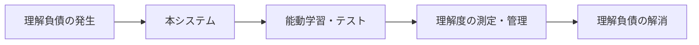
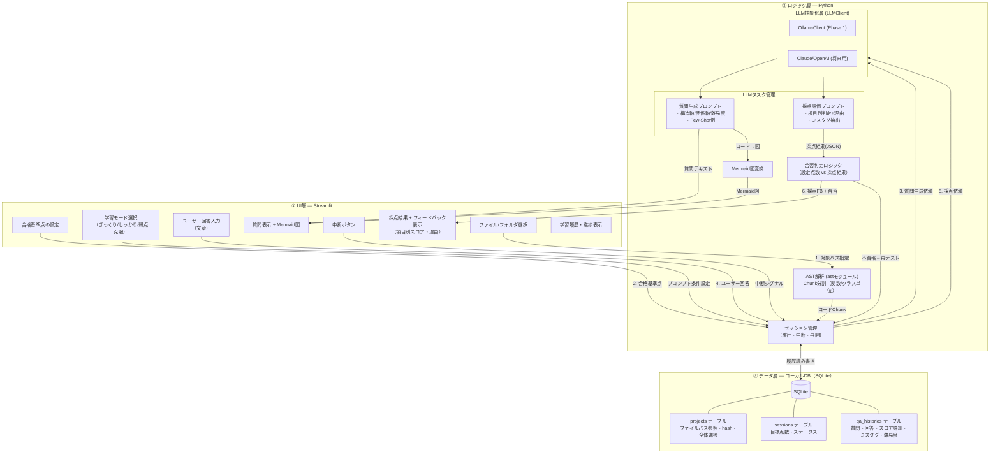
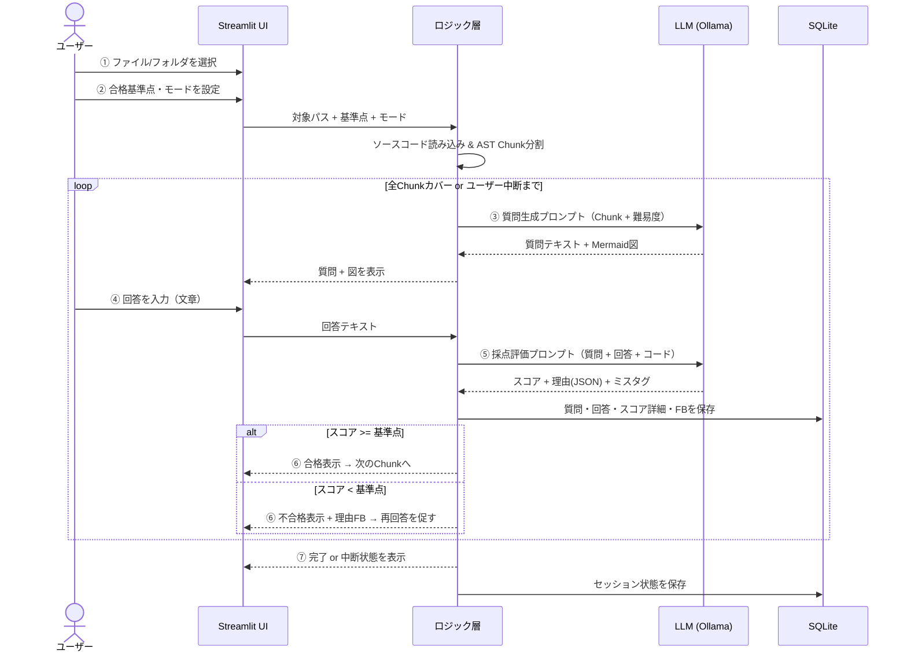
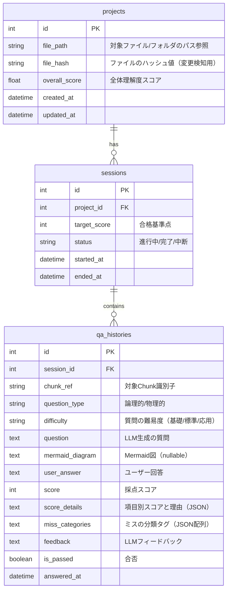
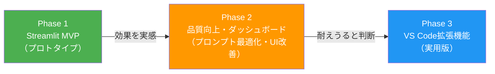

# コード理解サポートエージェント — システム全体構成図

> **ドキュメントバージョン**: v1.1（2026-08-05）  
> **原典**: `20260801_コード理解サポートエージェント_検討整理 - シート1 (2).csv`

---

## 1. システム概要

バイブコーディングによって発生する **「理解負債」** を、能動学習（アクティブラーニング）とテストによって解消・測定・管理するシステム。



> [!IMPORTANT]
> コード理解の「解説」ではなく、**質問→回答→採点→フィードバック** のサイクルによる能動学習に特化する（管理番号9, 9-1）

---

## 2. 全体アーキテクチャ（3層構成）



---

## 3. 操作フロー（ユーザーシーケンス）



---

## 4. データモデル（ER図）



> [!NOTE]
> ソースコード本体はDBに保存せず**パス参照**に留め、質問・回答・スコアの履歴のみを永続化する（管理番号8-1）。
> 
> **追加設計項目**（検討番号3-2-1-3, 3-2-1-3-2, 3-2-1-3-3）:
> - `file_hash`: ファイル変更検知。前回テスト時と内容が変わったか判定する
> - `score_details`: 項目別スコア+理由のJSON。「どこで間違えたか」を透明化する
> - `miss_categories`: ミス分類タグ。「考え方の癖」を将来分析・蓄積する
> - `difficulty`: 質問の難易度。段階的エスカレーションや弱点克服モードに使用する

---

## 5. LLM接続の抽象化（管理番号5-1-1）

```python
class LLMClient:
    """LLM通信を抽象化するインタフェース"""
    def ask(self, prompt: str) -> str:
        raise NotImplementedError

class OllamaClient(LLMClient):
    """Phase 1で採用するローカルLLM用クライアント"""
    def __init__(self, model: str = "llama3", base_url: str = "http://localhost:11434"):
        self.model = model
        self.base_url = base_url

    def ask(self, prompt: str) -> str:
        # Ollama API 呼び出し (temperature=0推奨)
        ...
```

> **方針**: Phase 1はOllamaのみ実装するが、`LLMClient` 抽象クラスを経由させることで、Phase 2以降のClaude / OpenAI APIへの差し替えコストを最小限に抑える。

---

## 6. 体験設計（UX）方針 3原則（管理番号4-2-1-1）

1. **具体的な変化を伝える**: 抽象的な褒め言葉ではなく「前回できなかった○○が今回できた」という客観的事実を伝える。
2. **間違えたら次の一手を示す**: 「不正解」で終わらせず「○○の記述に注目して再回答してください」と導く。
3. **ユーザーが自分で決められる**: テスト対象・基準点・モード・中断をユーザー自身の意思でコントロールさせる。

---

## 7. 開発ロードマップとPhase 1の完了判定（管理番号10-1）



### Phase 1 の目的
1つのPythonファイルを対象に、質問→回答→採点の最小ループを動かし、**「コード理解の深まり」を自分自身で体感できるか検証する**。

### Phase 1 完了判定4条件
1. LLMが的外れでない質問を生成できる
2. 採点とフィードバックの根拠（理由）が納得できる
3. 2回目の回答でスコアが上がる（学び直しループが動く）
4. 終了後に「このコードを説明できる」自信がつく

---

## 8. 技術スタック一覧

| レイヤー | 技術 | 備考 |
|:---|:---|:---|
| UI | Streamlit → VS Code Extension | Phase 1はStreamlit、Phase 3でVS Code |
| ロジック | Python (`ast` モジュール) | コード解析・Chunk分割・プロンプト構築 |
| LLM | ローカルLLM（Ollama等） | `LLMClient` 経由で呼び出し（管理番号5-1-1） |
| データ | SQLite | ローカルDB。パス参照方式（管理番号8-1） |
| 図表現 | Mermaid | プログラムをMermaid図に変換して表示（管理番号1-2-1） |
