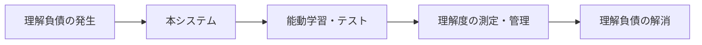
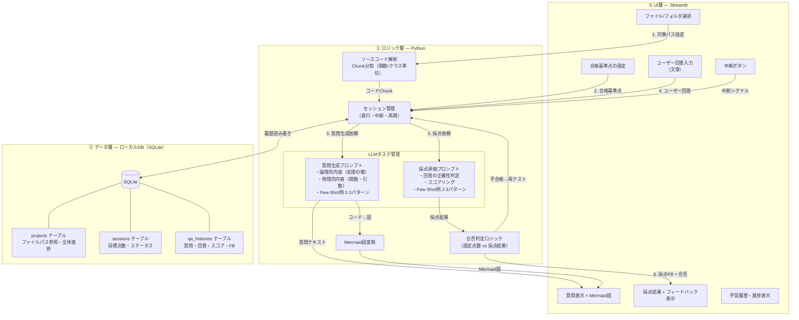
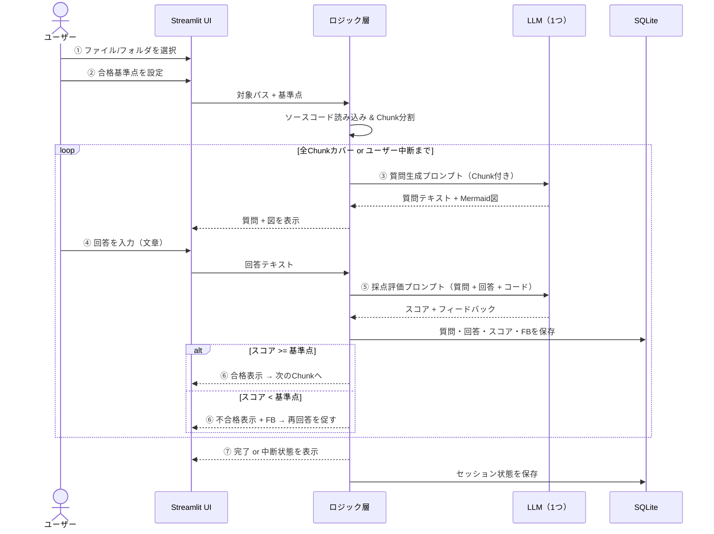
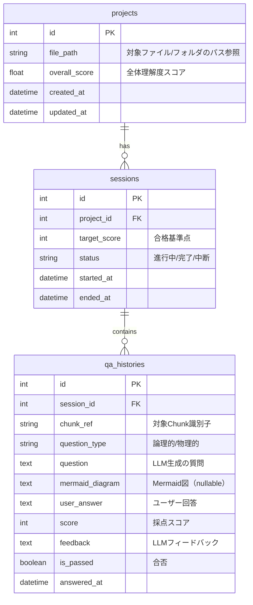
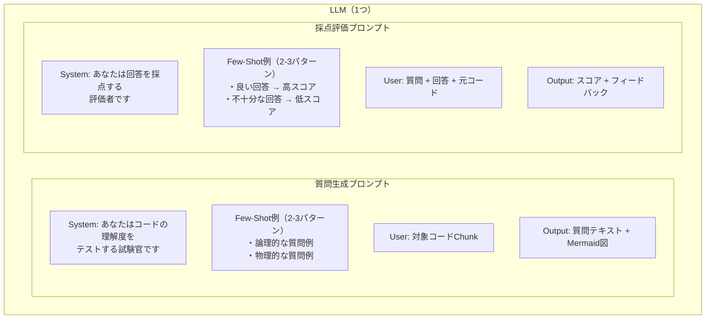
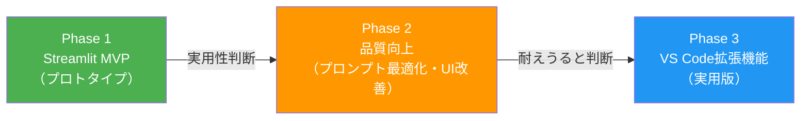
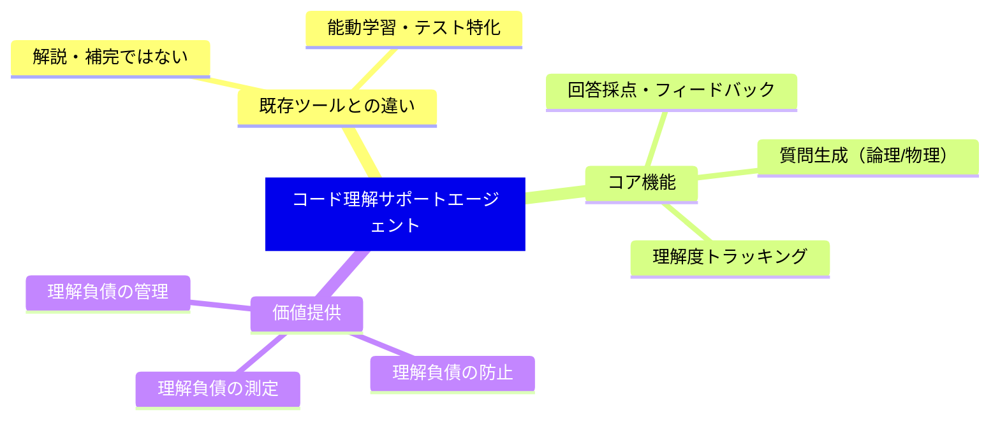

# コード理解サポートエージェント — システム全体構成図

> **ドキュメントバージョン**: v1.0（2026-08-02）
> **原典**: `20260801_コード理解サポートエージェント_検討整理 - シート1.pdf`

---

## 1. システム概要

バイブコーディングによって発生する **「理解負債」** を、能動学習（アクティブラーニング）とテストによって解消・測定・管理するシステム。

> [!IMPORTANT]
> コード理解の「解説」ではなく、**質問→回答→採点→フィードバック** のサイクルによる能動学習に特化する（管理番号9, 9-1）

---

## 2. 全体アーキテクチャ（3層構成）

---

## 3. 操作フロー（ユーザーシーケンス）

---

## 4. データモデル（ER図）

> [!NOTE]
> ソースコード本体はDBに保存しない。**パス参照**に留め、質問・回答・スコアの履歴のみを永続化する（管理番号8-1）

---

## 5. LLMプロンプト構成

---

## 6. 開発ロードマップ

| Phase | 形態 | 主な内容 |
|:---:|:---|:---|
| 1 | Streamlit（Python） | 最小ループ動作確認：1ファイル → 質問 → 回答 → 採点 |
| 2 | Streamlit（改善版） | プロンプトFew-Shot最適化、履歴表示、複数ファイル対応 |
| 3 | VS Code 拡張機能 | 開発フローとの統合、利用タイミングのモード分離（管理番号9-2） |

---

## 7. 技術スタック一覧

| レイヤー | 技術 | 備考 |
|:---|:---|:---|
| UI | Streamlit → VS Code Extension | Phase 1はStreamlit、Phase 3でVS Code |
| ロジック | Python | コード解析・セッション管理・プロンプト構築 |
| LLM | ローカルLLM（Ollama等） | API（Claude/OpenAI）も選択肢（管理番号5-1） |
| データ | SQLite | ローカルDB。パス参照方式（管理番号8-1） |
| 図表現 | Mermaid | プログラムをMermaid図に変換して表示（管理番号1-2-1） |

---

## 8. 差別化ポイント

