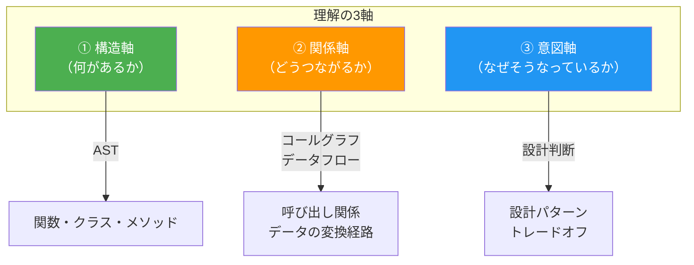
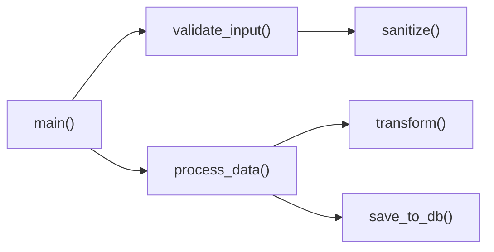
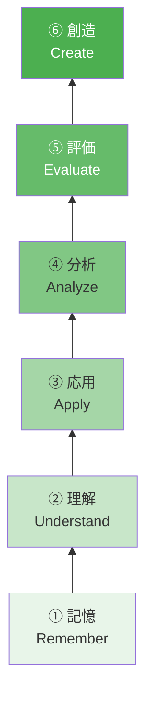
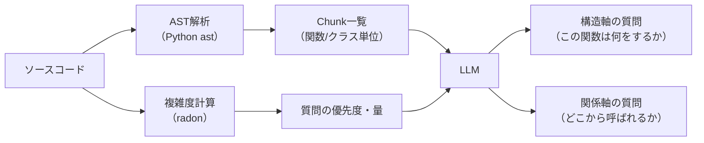

# 「理解した」とは何か — チャンク分割の軸と理解度指標の検討

> **目的**: チャンク分割の設計は「何をもって理解したと判断するか」の基準設計に直結する。AST以外に参考になる指標・アイデアを整理する。

---

## 核心の問い

```
チャンク分割の軸 ＝ 「理解の単位」の定義
                ＝ 何がわかれば"わかった"と言えるのか
```

ASTベースの分割（関数/クラス単位）は **物理的な構造** に基づく軸。
しかし、検討シートの管理番号1の定義を振り返ると：

> **「コード理解」= 動くプログラムの流れを何も見ずに他人に説明でき、かつ再現できること**

この定義には **構造の理解** だけでなく、**流れの理解**（なぜその順番なのか）や **意図の理解**（なぜこの設計なのか）が含まれている。

---

## 3つの理解軸

理解を追うための軸は大きく3つに分類できる。



---

### ① 構造軸 — AST（何があるか）

**今の設計の中心。物理的にコードの「部品」を捉える。**

| 対象 | 質問の例 |
|:---|:---|
| 関数 | 「`validate_input()`は何を受け取り、何を返すか？」 |
| クラス | 「`UserAuth`クラスの責務は何か？」 |
| メソッド | 「`login()`の引数と処理手順を説明せよ」 |

- **強み**: 機械的に分割しやすい、進捗率が出しやすい（10関数中7関数合格 = 70%）
- **弱み**: 関数単体を理解しても「全体の流れ」が理解できたことにはならない

---

### ② 関係軸 — コールグラフ・データフロー（どうつながるか）

**ASTだけでは捉えられない「関数間の関係」を追う。**



| 指標 | 質問の例 |
|:---|:---|
| **コールグラフ** | 「`main()`から`save_to_db()`に至るまでの呼び出し経路を説明せよ」 |
| **データフロー** | 「ユーザー入力はどの関数で検証され、どの関数でDBに保存されるか？」 |
| **状態変化** | 「`process_data()`を通過した後、データはどう変化するか？」 |

- **強み**: 「全体の流れ」の理解を測定できる（管理番号1-1「処理の内容と順番」に対応）
- **弱み**: 実装にはASTだけでなく静的解析が必要（Pythonなら`ast`+`importlib`、または`jedi`等）

> [!TIP]
> **MVP向けアイデア**: コールグラフの完全な静的解析は大変なので、Phase 1 では **LLMにコードを渡して「この関数はどこから呼ばれ、何を呼んでいるか」を分析させる** アプローチも実用的。

---

### ③ 意図軸 — 設計判断（なぜそうなっているか）

**コードの「動き」は理解しても、「なぜこう設計したか」が分からない状態はまだ理解負債。**

| 指標 | 質問の例 |
|:---|:---|
| **設計パターン** | 「なぜここでObserverパターンを使っているのか？」 |
| **トレードオフ** | 「キャッシュ層を入れた理由と、入れない場合のデメリットは？」 |
| **代替案** | 「この処理をfor文ではなくリスト内包表記にした理由は？」 |

- **強み**: 最も深い理解を測定できる
- **弱み**: 正解がコードに明示されていないため、LLMの採点精度が難しい

> [!WARNING]
> 意図軸はPhase 1では難しい。バイブコーディングで生成されたコードの場合、**生成者（AI）の設計意図を後から推測する**ことになり、LLMの採点が主観的になるリスクがある。

---

## 教育科学からの参考アイデア

理解度の測定・学習効果の最大化には、教育科学の知見が直接参考になる。

### Bloom's Taxonomy（ブルームの分類学）

理解の深さを6段階で定義した教育理論。**質問の難易度設計**に使える。



| レベル | Fathomでの質問例 | 管理番号との対応 |
|:---|:---|:---|
| ① 記憶 | 「`login()`の引数を3つ挙げよ」 | 1-1-1（物理的内容） |
| ② 理解 | 「`login()`が例外を投げるのはどういう場合か説明せよ」 | 1-1-1（論理的内容） |
| ③ 応用 | 「新しい認証方式を追加する場合、どこを変更するか？」 | 1-3（再現） |
| ④ 分析 | 「`validate()`を削除した場合、どの処理が影響を受けるか？」 | 関係軸 |
| ⑤ 評価 | 「このエラーハンドリングは適切か？改善点は？」 | 意図軸 |
| ⑥ 創造 | 「この処理を別のアルゴリズムで再実装せよ」 | スコープ外 |

> [!IMPORTANT]
> **Phase 1 の提案**: まずは **①記憶 + ②理解** に集中し、合格した場合にのみ **③応用** レベルの質問を出す。Bloomの分類をスコアリングに組み込めば、「浅い理解は合格だが深い理解はまだ」という粒度の判定ができる。

---

### テスティング効果（Testing Effect）

> 情報を「読む」よりも「テストされる」方が記憶定着率が高い。

これはFathomのコンセプトそのもの。管理番号9-1の差別化（能動学習特化）と一致する。

---

### 間隔反復（Spaced Repetition）

> 時間をおいてから再テストすると、記憶の定着がさらに強化される。

| 活用アイデア | 実装イメージ |
|:---|:---|
| 合格したChunkも1週間後に再テスト | `qa_histories.answered_at` から経過日数を計算 |
| スコアが低かったChunkほど短い間隔で再出題 | スコアに基づく再テスト間隔の計算 |
| 忘却曲線に基づく優先度キュー | Ankiのようなアルゴリズム（SM-2等） |

> [!NOTE]
> Phase 1 では間隔反復は不要だが、`qa_histories` に `answered_at` を記録しておけば、後から容易に組み込める。現在のDBスキーマはこの拡張に対応している。

---

### 認知負荷理論（Cognitive Load Theory）

> ワーキングメモリは同時に **4±1個** の情報チャンクしか処理できない。

| 示唆 | Chunk設計への反映 |
|:---|:---|
| 1つのChunkに含める関数は **4つ以下** | クラスが大きい場合はメソッド群で分割 |
| 1回の質問で問う概念は **2〜3個** | 「引数を全部列挙せよ」より「この関数の目的と主要な引数2つ」 |
| 依存する前提知識はChunk内に含める | import先の関数の説明を文脈として付与 |

---

## ソフトウェアメトリクスからの参考アイデア

AST以外に、コードの複雑さ・重要度を測る既存の指標がある。これらは **Chunkの優先度付け** や **質問の難易度調整** に使える。

| メトリクス | 意味 | Fathomでの活用 |
|:---|:---|:---|
| **循環的複雑度**（Cyclomatic Complexity） | 分岐の多さ。高いほど理解が難しい | 複雑度が高いChunkに多くの質問を割り当てる |
| **Fan-in / Fan-out** | 呼ばれる数 / 呼ぶ数 | Fan-inが高い関数 = 多くの場所から使われる = 理解優先度が高い |
| **結合度 / 凝集度** | モジュール間の依存の強さ | 高結合な関数群はまとめて1Chunkにする |
| **変更頻度**（git log） | よく変更されるファイル | 変更が多い = 理解が追いつかないリスク |

> [!TIP]
> `radon`（Python）を使えば循環的複雑度をコマンド一発で計算できる。  
> `git log --format='%H' --follow <file> | wc -l` で変更頻度も取れる。

---

## 提案: Fathom向けの理解度モデル

上記を統合した、**3軸 × 深さレベル** のマトリクスを提案する。

```
                ① 構造軸        ② 関係軸          ③ 意図軸
              （何があるか）  （どうつながるか）  （なぜそうか）
            ┌──────────────┬───────────────┬──────────────┐
   深い     │ 引数・戻り値 │ データフロー  │ 設計判断     │ ← Phase 2-3
   理解     │ の意味を説明 │ を端から端まで│ の根拠を説明 │
            ├──────────────┼───────────────┼──────────────┤
   基本     │ 関数の目的・ │ 呼び出し関係 │              │ ← Phase 1
   理解     │ 処理手順を   │ を説明できる  │（スコープ外）│    ターゲット
            │ 説明できる   │               │              │
            ├──────────────┼───────────────┼──────────────┤
   表面     │ 関数名から   │               │              │
   理解     │ 役割を推測   │（測定しない） │（測定しない）│
            └──────────────┴───────────────┴──────────────┘
```

### Phase 1 MVPの理解度判定基準（提案）

| 判定 | 条件 |
|:---|:---|
| **合格** | ① 構造軸の基本理解 + ② 関係軸の基本理解 の両方で基準点以上 |
| **部分合格** | ①は合格だが②が不合格 → 関係軸の質問を追加 |
| **不合格** | ①が不合格 → 同じChunkで再テスト |

### ASTだけでいくか？

**結論: ASTを主軸にしつつ、LLMに関係軸の分析を委ねるハイブリッドが現実的。**

| 処理 | 担当 | 理由 |
|:---|:---|:---|
| Chunk分割 | **AST（Python `ast`）** | 機械的・高速・確実 |
| 呼び出し関係の分析 | **LLM** | 静的解析の実装コストを回避 |
| 質問生成 | **LLM** | 構造軸 + 関係軸の質問を両方生成 |
| 難易度調整 | **循環的複雑度**（`radon`） | Chunkごとの質問数・深さを調整 |



---

## まとめ: 次に検討すべきこと

| # | 検討テーマ | 判断軸 |
|:---|:---|:---|
| 1 | **Phase 1 で② 関係軸をどこまで入れるか** | LLMに任せるなら低コストで導入可能 |
| 2 | **Bloomのレベルを採点に反映するか** | 「記憶レベルの理解」と「応用レベルの理解」を区別するか |
| 3 | **循環的複雑度で質問量を調整するか** | 簡単な関数に何問も出す必要はない |
| 4 | **間隔反復をPhase 1のDBスキーマに見込むか** | フィールド追加だけなら今やるコストはゼロ |
